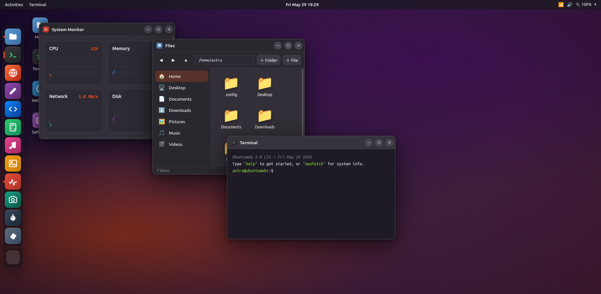

# 🎛️ Ubuntu Studio Plasma Web OS

> A complete Ubuntu Studio/KDE Plasma-style Linux desktop environment that runs entirely in a single HTML file — no build step, no server, no dependencies.

An experiment in seeing how far a single prompt to **Claude Opus 4.8** could go: build a believable, genuinely *functional* web operating system in one self-contained `.html` file you can just open in Chrome.

The result is a full desktop shell — boot splash, login screen, Plasma panel, launcher, window manager — plus **15 working applications**, a persistent virtual filesystem, live system graphs, a Web-Audio music synth, and a real webcam app. Everything is vanilla HTML/CSS/JavaScript in **one file (~1,400 lines)**.



---

## ✨ Try it

```bash
# clone and open — that's the whole setup
git clone https://github.com/muneebhashone/ubuntu-opus.git
cd ubuntu-opus
xdg-open webos.html     # or: open webos.html  (macOS) / just double-click it
```

At the login screen, **press Enter** (no password needed) to reach the desktop.

> Tip: the Camera app needs camera permission, and some real websites refuse to load in the browser's sandboxed frame — that's expected.

---

## 🖥️ What's inside

### The shell (Ubuntu Studio / KDE Plasma feel)
- Animated **boot splash** → **login screen** with live clock → fade into the desktop
- KDE Plasma-style **bottom panel** — launcher, task manager, live date/clock with a **calendar dropdown**, system tray with Wi-Fi / Bluetooth / brightness / volume toggles, and a **battery that actually drains and charges**
- Plasma **task manager** — pinned apps, running-app indicators, tooltips, and an application launcher
- **Application Launcher** (`Super` key) — live window thumbnails + searchable app grid
- **Window manager** — drag, 8-way resize, minimize / maximize / close, focus z-ordering, **edge-snapping** (drag to top/left/right halves), double-click titlebar to maximize
- Right-click desktop **context menu**, toast **notifications**, and **lock / power** screens

### Fully functional apps
| App | What it does |
| --- | --- |
| 🖥️ **Terminal** | Real command interpreter over the live filesystem: `ls cd cat echo mkdir touch rm pwd edit open neofetch cowsay history` + tab-completion, history, and easter eggs (`matrix`, `barrelroll`, `sudo`) |
| 📁 **Dolphin** | KDE-style file browser — create / rename / delete, back/forward/up, sidebar places, opens files in the right app |
| 📝 **Kate** | Open, edit and save files to the persistent filesystem |
| 🧑‍💻 **Code** | VS Code-style editor with explorer, tabs, line numbers and a live HTML **Run** preview |
| 🧮 **Calculator** | Keyboard-driven, full expression evaluation |
| 📊 **System Monitor** | Live animated CPU / RAM / Network / Disk canvas graphs + process list |
| 🎵 **Music** | Generative tracks via the **Web Audio API** with a circular visualizer |
| 📷 **Camera** | Real `getUserMedia` webcam with live CSS filters; photos save to Pictures |
| 🖼️ **Image Viewer** | Gallery with filmstrip navigation (renders procedural SVG art) |
| 🎨 **Paint** | Brush, eraser, colors, sizes; exports PNGs to disk |
| 🌐 **Firefox** | Internal pages (start page, search, wiki) + sandboxed real-site frames |
| 💣 **Minesweeper** | Complete game with flags, timer and first-click safety |
| 🛍️ **Discover** | Browse and "install" creative apps with progress |
| ⚙️ **Settings** | Themes, **7 accent colors** & **7 wallpapers** that re-theme the whole UI live |
| ❓ **Help** | Shortcuts and a guided tour |

### Details you might not expect
- The **Ubuntu font** (loaded from Google Fonts) for authenticity
- Film-grain + vignette overlay on the wallpaper
- **Dark / light themes** and accent colors that recolor the *entire* UI instantly
- A working `neofetch` with Ubuntu Studio Plasma system details
- Files, photos and drawings that **survive a page reload** (stored in `localStorage`)
- Keyboard shortcuts: `Super` (launcher), `Ctrl+Alt+T` (terminal), `Super+E` (files), `Super+D` (show desktop), `Alt+Tab` (cycle windows), `Esc` (close menus)

---

## ⌨️ Keyboard shortcuts

| Shortcut | Action |
| --- | --- |
| `Super` | Application Launcher |
| `Ctrl+Alt+T` | Open Terminal |
| `Super+E` | Open Dolphin |
| `Super+D` | Minimize all windows |
| `Alt+Tab` | Cycle windows |
| `Esc` | Close overview / menus |

---

## 🛠️ Tech notes

- **Zero dependencies** — pure HTML/CSS/JS in a single file. The only external resource is the Ubuntu webfont.
- **Persistence** — the virtual filesystem and settings are stored in `localStorage`. Reset everything from **Settings → Users → Reset OS**.
- **Audio** — the Music app and sound test use the Web Audio API to synthesize tones live; nothing is bundled.
- Tested in **Chrome / Chromium**. Should work in any modern Chromium-based browser.

---

## 🧪 About the experiment

This repository is a single-shot creative/engineering experiment with **Claude Opus 4.8**: how complete and polished a "web OS" could be produced as one pasteable HTML file, then verified end-to-end in a real browser. The entire desktop — shell, window manager, and all 15 apps — lives in [`webos.html`](webos.html).

## 📄 License

MIT — do whatever you like. See [LICENSE](LICENSE).
